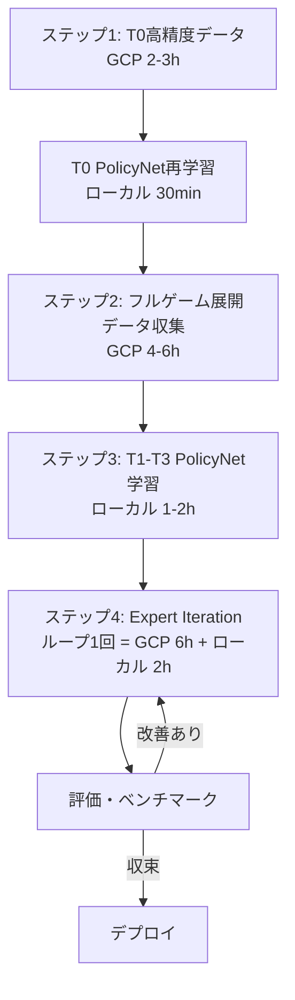

# OFC Pineapple AI - 計算順序ロードマップ

## 現状の整理

### アクション数（各ターン）

| ターン | カード | アクション数 | 枝刈り必要？ | 備考 |
|---|---|---|---|---|
| **T0** | 5枚配置 | **232** | ✅ Top-50に枝刈り | PolicyNet済み |
| **T1** | 3枚(1捨2配) | **12** | ❌ 全探索可能 | 常に12 |
| **T2** | 3枚(1捨2配) | **9** | ❌ 全探索可能 | 常に9 |
| **T3** | 3枚(1捨2配) | **3** | ❌ 全探索可能 | 常に3 |

> [!IMPORTANT]
> T1-T3はアクション数が少ないため、PolicyNetによる枝刈りは不要。
> 全アクションをMCで直接評価できる。
> 枝刈りが効くのはT0（232→50）のみ。

### 既存のアセット

| アセット | 状態 | パス |
|---|---|---|
| T0 PolicyNet (BC) | ✅ 学習済み | `ai/models/t0_bc/bc_policy_best.pt` |
| T0 フィルタパイプライン | ✅ 実装済み | `generate_filtered_t0.py` + Rust |
| T0 学習データ (旧) | ✅ 500ハンド | `ai/data/t0_cfr_500h_*.jsonl` |
| T1-T3 PolicyNet | ❌ 未着手 | — |
| ValueNet | ❌ 未着手 | — |
| セルフプレイ | ❌ 未着手 | — |

---

## 計算の順序

### ステップ1: T0高精度データ再収集（GCP）

**目的**: PolicyNetで枝刈りした50配置を高精度MCで評価し、より正確なT0学習データを作る

```
Python: 500ハンド → Top-50 pre-filter → filtered_t0.json
Rust:   filtered_t0.json → MC(samples=30, nesting=10,6,3) → t0_filtered.jsonl
Python: t0_filtered.jsonl → convert_t0_cfr.py → BC学習データ (24x aug = 12,000サンプル)
```

**推定コスト**: GCP 64core で ~2-3時間

> [!NOTE]
> このステップで生成されるのは「T0だけの配置品質データ」。
> T0のPolicyNetを再学習してさらに精度を上げる（iterative refinement）。

---

### ステップ2: T1-T3のデータ収集

> [!IMPORTANT]
> **ここが重要な設計判断ポイント**
>
> T1-T3の学習データをどう作るか？2つのアプローチ：

#### 方式A: 独立ターン評価（シンプル）

各ターンを独立に評価。T0の配置結果を固定して、T1の全12アクションをMC評価。

```
T0: PolicyNetでベスト配置を選択（固定）
T1: ランダムに3枚ディール → 全12アクションをMC評価
T2: T1のベスト配置後 → 3枚ディール → 全9アクションをMC評価  
T3: T2のベスト配置後 → 3枚ディール → 全3アクションをMC評価
```

**メリット**: シンプル、各ターン独立に並列化可能
**デメリット**: T0の配置が固定なので、T0の選択ミスが全ターンに伝播

#### 方式B: フルゲーム展開（高精度）

1ハンド全体を展開し、各ターンの状態と最適行動を同時に記録。

```
T0: PolicyNet Top-50 → MC評価 → ベスト配置
T1: 3枚ディール → 全12アクション MC評価 → ベスト配置
T2: 3枚ディール → 全9アクション MC評価 → ベスト配置
T3: 3枚ディール → 全3アクション MC評価
→ 1ハンドからT0,T1,T2,T3の4レコードを出力
```

**メリット**: 1回の計算で全ターンのデータが取れる、状態遷移が自然
**デメリット**: 実装が複雑、T0の選択に全ターンが依存

> [!NOTE]
> **推奨: 方式B**
> 
> 理由: 1ハンドで4ターン分のデータが取れて効率的。
> また、セルフプレイへの移行時にこの「フルゲーム展開」の仕組みがそのまま使える。

---

### ステップ3: T1-T3 PolicyNet学習

T1-T3のアクション数はT0と異なるため、ネットワーク構造の選択肢：

#### 選択肢1: ターン別モデル（4つのPolicyNet）

| モデル | 入力 | 出力 | 学習データ |
|---|---|---|---|
| PolicyNet_T0 | 522dim | 250 (max actions) | T0のみ |
| PolicyNet_T1 | 522dim | 12 | T1のみ |
| PolicyNet_T2 | 522dim | 9 | T2のみ |
| PolicyNet_T3 | 522dim | 3 | T3のみ |

**メリット**: 各ターンに特化、出力次元が小さく学習しやすい
**デメリット**: モデルが4つ、管理が煩雑

#### 選択肢2: 統合モデル（1つのPolicyNet）

| モデル | 入力 | 出力 | 学習データ |
|---|---|---|---|
| PolicyNet_unified | 522dim + turn_id | 250 | 全ターン混合 |

**メリット**: 1モデルで全ターン対応、ターン間の知識共有
**デメリット**: T3(3アクション)に250次元出力は無駄

> [!NOTE]
> **推奨: ターン別モデル**
> 
> 理由: T0は枝刈りに使うが、T1-T3はアクション数が少なく
> 枝刈り不要。セルフプレイ時のaction selection用としてのみ使う。
> 統合モデルは後で検討可能。

---

### ステップ4: セルフプレイ強化

#### 4a: セルフプレイの構造

OFC Pineappleは**2人対戦**で、各プレイヤーが独立にボードを構築。
相手のボードは**見えない**（不完全情報）。

```
Player A: T0 → T1 → T2 → T3 → 完成ボード
Player B: T0 → T1 → T2 → T3 → 完成ボード
→ スコア比較（ロウ勝負 + ロイヤリティ + FL）
```

#### 4b: 強化学習手法の選択肢

| 手法 | 概要 | 適合性 |
|---|---|---|
| **PPO** | PolicyNetを直接更新 | ◎ シンプル、安定 |
| **MCTS + PolicyNet** | AlphaZero式 | △ 木探索の恩恵は限定的（相手見えない） |
| **CFR** | 後悔最小化 | △ アクション空間が状態依存で困難 |
| **Expert Iteration** | データ生成→学習ループ | ◎ 今のパイプラインの延長 |

> [!NOTE]
> **推奨: Expert Iteration（今のパイプラインの延長）**
> 
> 1. PolicyNetでプレイ → MCで各行動を評価 → ベスト行動でデータ生成
> 2. 新データでPolicyNet再学習
> 3. 1-2を繰り返し
> 
> これは現在のT0パイプラインそのもの。T1-T3に拡張するだけ。

---

## 全体タイムライン



### 見積もり

| ステップ | GCP時間 | ローカル時間 | 出力 |
|---|---|---|---|
| 1. T0高精度データ | 2-3h | 30min学習 | T0 PolicyNet v2 |
| 2. フルゲーム展開 | 4-6h | — | T0-T3 全ターンデータ |
| 3. T1-T3学習 | — | 1-2h | T1,T2,T3 PolicyNet |
| 4. Expert Iteration ×N | N×6h | N×2h | 強化されたPolicyNet群 |

---

## 議論ポイント

1. **ステップ2の方式**: A（独立ターン）vs B（フルゲーム展開）、どちらが良いか？
2. **ステップ3のモデル構造**: ターン別 vs 統合、どちらにするか？
3. **Expert Iterationの回数**: 何ラウンド回すか？（3-5回で十分？）
4. **評価方法**: 強さをどう測定するか？（ランダム対戦のEV？人間との対戦？）
5. **GCPコスト**: 全体でどの程度の予算を想定するか？
6. **Fantasyland**: FL突入時の別ソルバー（fl_solver）との統合はいつ行うか？
